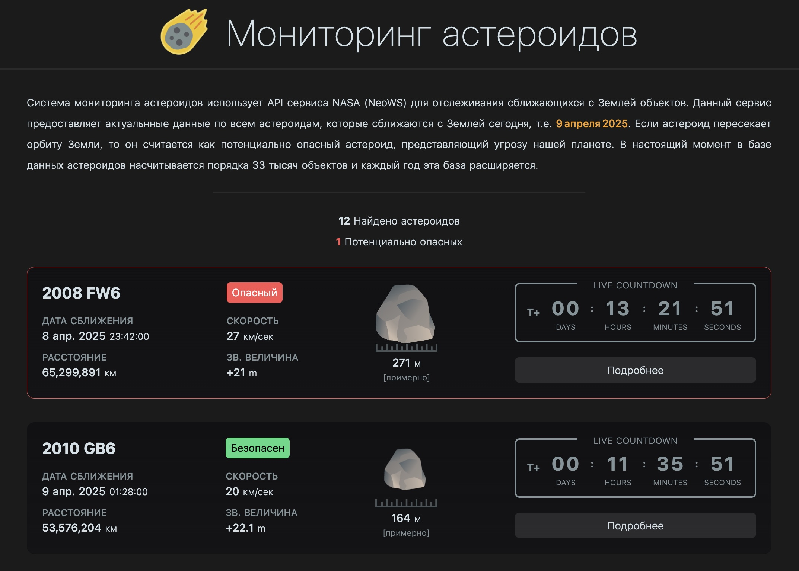

<a id="top"></a>

<!-- PROJECT TITLE -->
A web application for real-time tracking of near-Earth objects using NASA's NeoWS (Near-Earth Object Web Service) API. Built with Next.js, TypeScript, and Redux.

<div align="center">
  <!-- -->

<h3>Asteroid Monitoring</h3>

<a href="https://https://asteroid.miksoft.pro/" target="_blank">Demo</a>
·
<a href="#contact">Contact</a>
</div>

<br />

<!-- PROJECT BADGES -->
<div align="center">

[![Contributors][contributors-badge]][contributors-url]
[![Forks][forks-badge]][forks-url]
[![Stargazers][stars-badge]][stars-url]
[![Issues][issues-badge]][issues-url]
[![MIT License][license-badge]][license-url]

[](https://github.com/miksrv/asteroid-monitoring/actions/workflows/checks.yml)
[](https://github.com/miksrv/asteroid-monitoring/actions/workflows/deploy.yml)
[](https://sonarcloud.io/summary/new_code?id=miksrv_asteroid-monitoring)
[](https://sonarcloud.io/summary/new_code?id=miksrv_asteroid-monitoring)

</div>

---

<!-- TABLE OF CONTENTS -->
### Table of Contents

- [About of Project](#about-of-project)
    - [Key Features](#key-features)
    - [Built With](#built-with)
- [Installation](#installation)
- [Live Demo](#live-demo)
- [Contributing](#contributing)
- [License](#license)
- [Acknowledgments](#acknowledgments)
- [Contact](#contact)

<!-- ABOUT OF PROJECT -->
## About of Project

Asteroid Monitoring is a system that fetches and displays real-time data about asteroids approaching Earth using the NASA NeoWS API. The application provides detailed information on each object, including:



- Time of close approach
- Distance from Earth
- Relative velocity
- Estimated size range
- Orbit visualization

If an asteroid's trajectory intersects Earth's orbit, it is flagged as potentially hazardous. The database currently includes over 33,000 near-Earth objects and is constantly growing as new discoveries are made.

The app shows data for the current day (e.g., April 9, 2025) and is intended to raise awareness about the dynamic nature of our Solar System and the importance of planetary defense initiatives.

### Key Features:
- 🌍 Fetches daily data from NASA NeoWS API
- 📋 Displays a list of asteroids approaching Earth today
- ⏱️ Shows approach time, distance, velocity, and size
- 🛑 Flags potentially hazardous asteroids
- 🛰️ Interactive orbit visualization for each object
- ⚙️ Built with modern stack: Next.js, TypeScript, Redux

The system is highly customizable, and additional sensors can be integrated to expand its functionality. This project demonstrates how microcontrollers, web development, and real-time data processing can be combined to create a fully functional, real-world application.

<p align="right">
  (<a href="#top">Back to top</a>)
</p>

### Built With

- [![JavaScript][js-badge]][js-url] Core languages used in frontend development.
- [![TypeScript][ts-badge]][ts-url] TypeScript extends JavaScript by adding types to the language.
- [![NextJS][nextjs-badge]][nextjs-url] React-based frontend framework for building the user interface.
- [![Redux][redux-badge]][redux-url] State management for the frontend, providing predictable and centralized state.
- [![NodeJS][nodejs-badge]][nodejs-url] JavaScript runtime used for frontend development and package management.
- [![Sass][sass-badge]][sass-url] Styling the user interface.
- [![GitHub Actions][githubactions-badge]][githubactions-url] Continuous integration and deployment pipeline for automating tests and deployment processes.
- [![SonarCloud][sonarcloud-badge]][sonarcloud-url] Code quality and security analysis.

<p align="right">
  (<a href="#top">Back to top</a>)
</p>

<!-- INSTALLATION -->
## Installation

Follow these steps to install and run the Asteroid Monitoring project on your local machine.

### Prerequisites

Make sure you have the following installed on your system:
- **Node.js** (v20 or higher)
- **NPM** or **Yarn** (for frontend dependencies)

1. Clone the repository

```bash
git clone https://github.com/miksrv/asteroid-monitoring.git
cd asteroid-monitoring
```

2. Install dependencies:

   ```bash
   yarn install
   ```

3. Run the frontend in development mode:

   ```bash
   yarn run dev
   ```

<!-- LIVE DEMO -->
## Live Demo

Explore the fully functioning asteroid monitoring web application at:
🌐 [Live Demo](https://asteroid.miksoft.pro/)

<p align="right">
  (<a href="#top">Back to top</a>)
</p>

<!-- CONTRIBUTING -->
## Contributing

Contributions are what make the open-source community an incredible environment for learning, inspiration, and innovation. Your contributions are highly valued and greatly appreciated, whether it’s reporting bugs, suggesting improvements, or creating new features.

**To contribute:**

1. Fork the project by clicking the "Fork" button at the top of this page.
2. Clone your fork locally:
   ```bash
   git clone https://github.com/miksrv/asteroid-monitoring.git
   ```
3. Create a new feature branch:
   ```bash
   git checkout -b feature/AmazingFeature
   ```
4. Make your changes, then commit them:
   ```bash
   git commit -m "Add AmazingFeature"
   ```
5. Push your changes to your forked repository:
   ```bash
   git push origin feature/AmazingFeature
   ```
6. Open a pull request from your feature branch to the main repository.

We encourage contributions of all kinds, whether big or small. Your efforts help improve the project for everyone!

<!-- LICENSE -->
## License

Distributed under the MIT License. See [LICENSE](LICENSE) for more information.

<p align="right">
  (<a href="#top">Back to top</a>)
</p>

<!-- CONTACT -->
## Contact

Misha - [miksoft.pro](https://miksoft.pro)

<p align="right">
  (<a href="#top">Back to top</a>)
</p>

<!-- MARKDOWN VARIABLES (LINKS, IMAGES) -->
[contributors-badge]: https://img.shields.io/github/contributors/miksrv/asteroid-monitoring.svg?style=for-the-badge
[contributors-url]: https://github.com/miksrv/asteroid-monitoring/graphs/contributors
[forks-badge]: https://img.shields.io/github/forks/miksrv/asteroid-monitoring.svg?style=for-the-badge
[forks-url]: https://github.com/miksrv/asteroid-monitoring/network/members
[stars-badge]: https://img.shields.io/github/stars/miksrv/asteroid-monitoring.svg?style=for-the-badge
[stars-url]: https://github.com/miksrv/asteroid-monitoring/stargazers
[issues-badge]: https://img.shields.io/github/issues/miksrv/asteroid-monitoring.svg?style=for-the-badge
[issues-url]: https://github.com/miksrv/asteroid-monitoring/issues
[license-badge]: https://img.shields.io/github/license/miksrv/asteroid-monitoring.svg?style=for-the-badge
[license-url]: https://github.com/miksrv/asteroid-monitoring/blob/master/LICENSE.txt

<!-- Other ready-made icons can be seen for example here: https://github.com/inttter/md-badges -->
[js-badge]: https://img.shields.io/badge/JavaScript-F7DF1E?logo=javascript&logoColor=000
[js-url]: https://www.javascript.com/
[ts-badge]: https://img.shields.io/badge/TypeScript-3178C6?logo=typescript&logoColor=fff
[ts-url]: https://www.typescriptlang.org/
[nextjs-badge]: https://img.shields.io/badge/Next.js-black?logo=next.js&logoColor=white
[nextjs-url]: https://nextjs.org/
[nodejs-badge]: https://img.shields.io/badge/Node.js-6DA55F?logo=node.js&logoColor=white
[nodejs-url]: https://nodejs.org/
[redux-badge]: https://img.shields.io/badge/Redux-764ABC?logo=redux&logoColor=fff
[redux-url]: https://redux.js.org/
[sass-badge]: https://img.shields.io/badge/Sass-C69?logo=sass&logoColor=fff
[sass-url]: https://sass-lang.com/
[sonarcloud-badge]: https://img.shields.io/badge/SonarCloud-F3702A?logo=sonarcloud&logoColor=fff
[sonarcloud-url]: https://sonarcloud.io/
[githubactions-badge]: https://img.shields.io/badge/GitHub_Actions-2088FF?logo=github-actions&logoColor=white
[githubactions-url]: https://docs.github.com/en/actions
