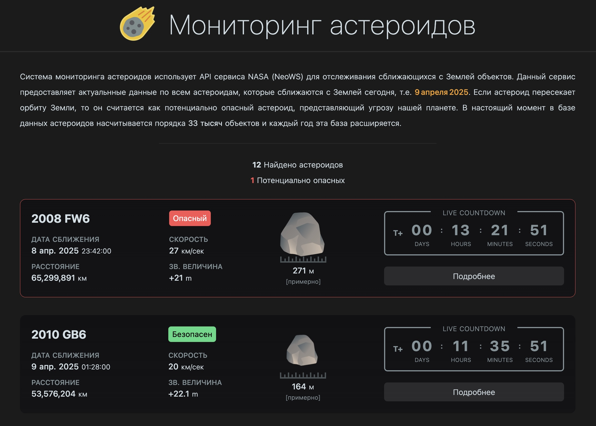

<a id="top"></a>

<!-- PROJECT TITLE -->

<div align="center">
  

<h3>Asteroid Monitoring</h3>

<p>A web application for real-time tracking of near-Earth objects using NASA's NeoWS API.</p>

<a href="https://asteroid.miksoft.pro/" target="_blank">Live Demo</a>
·
<a href="#contact">Contact</a>

</div>

<br />

<!-- PROJECT BADGES -->
<div align="center">

[![Contributors][contributors-badge]][contributors-url]
[![Forks][forks-badge]][forks-url]
[![Stargazers][stars-badge]][stars-url]
[![Issues][issues-badge]][issues-url]
[![MIT License][license-badge]][license-url]

[](https://github.com/miksrv/asteroid-monitoring/actions/workflows/checks.yml)
[](https://github.com/miksrv/asteroid-monitoring/actions/workflows/deploy.yml)
[](https://sonarcloud.io/summary/new_code?id=miksrv_asteroid-monitoring)
[](https://sonarcloud.io/summary/new_code?id=miksrv_asteroid-monitoring)

</div>

---

<!-- TABLE OF CONTENTS -->

### Table of Contents

- [About the Project](#about-the-project)
    - [Key Features](#key-features)
    - [Built With](#built-with)
- [Installation](#installation)
- [Live Demo](#live-demo)
- [Contributing](#contributing)
- [License](#license)
- [Acknowledgments](#acknowledgments)
- [Contact](#contact)

<!-- ABOUT THE PROJECT -->

## About the Project

Asteroid Monitoring is a web application that fetches and visualizes real-time data about near-Earth objects (NEOs) using the [NASA NeoWS API](https://api.nasa.gov/). It displays all asteroids making a close approach to Earth on the current day, giving users an at-a-glance view of each object's key characteristics.



For each asteroid the application shows:

- Date and time of close approach
- Miss distance from Earth
- Relative velocity
- Estimated diameter range
- Interactive 3D orbit visualization powered by spacekit.js

Asteroids whose trajectories bring them within a defined distance of Earth's orbit are flagged as **potentially hazardous**. NASA's database currently tracks over 33,000 near-Earth objects, and the count grows continuously as new discoveries are made.

### Key Features

- 🌍 Fetches daily near-Earth object data from the NASA NeoWS API
- 📋 Lists all asteroids with a close approach scheduled for today
- ⏱️ Shows approach time, miss distance, relative velocity, and estimated size
- 🛑 Highlights potentially hazardous asteroids
- 🛰️ Interactive 3D orbit visualization for each object
- 🌐 Bilingual interface: Russian and English (auto-detected from browser locale)
- ⚡ Offline-capable: API responses are cached in localStorage to minimize repeated requests
- ⚙️ Statically exported — deploys as plain HTML with no server required

<p align="right">
  (<a href="#top">Back to top</a>)
</p>

### Built With

- [![TypeScript][ts-badge]][ts-url] Strongly typed JavaScript for safer, more maintainable code.
- [![NextJS][nextjs-badge]][nextjs-url] React framework used for static site generation (`output: 'export'`).
- [![Redux][redux-badge]][redux-url] RTK Query for data fetching, caching, and state management.
- [![Sass][sass-badge]][sass-url] CSS Modules with Sass for component-scoped styling.
- [![NodeJS][nodejs-badge]][nodejs-url] JavaScript runtime for development and package management.
- [![GitHub Actions][githubactions-badge]][githubactions-url] CI/CD pipeline for automated linting, testing, and deployment.
- [![SonarCloud][sonarcloud-badge]][sonarcloud-url] Continuous code quality and security analysis.

<p align="right">
  (<a href="#top">Back to top</a>)
</p>

<!-- INSTALLATION -->

## Installation

Follow these steps to run Asteroid Monitoring locally.

### Prerequisites

- **Node.js** v20.11.0 (see `.nvmrc`)
- **Yarn** 4.x (`corepack enable && corepack prepare yarn@4.9.2 --activate`)

### Steps

1. Clone the repository:

    ```bash
    git clone https://github.com/miksrv/asteroid-monitoring.git
    cd asteroid-monitoring
    ```

2. Install dependencies:

    ```bash
    yarn install
    ```

3. Obtain a free NASA API key at [api.nasa.gov](https://api.nasa.gov/).

4. Create a `.env` file in the project root:

    ```bash
    NEXT_PUBLIC_API_KEY=your_nasa_api_key_here
    ```

5. Start the development server:

    ```bash
    yarn dev
    ```

    The app will be available at `http://localhost:3000`.

### Available Scripts

| Command               | Description                                |
| --------------------- | ------------------------------------------ |
| `yarn dev`            | Start development server                   |
| `yarn build`          | Production build (static export to `/out`) |
| `yarn test`           | Run unit tests with coverage               |
| `yarn eslint:check`   | Check linting                              |
| `yarn prettier:check` | Check formatting                           |

<p align="right">
  (<a href="#top">Back to top</a>)
</p>

<!-- LIVE DEMO -->

## Live Demo

The production build is available at:
🌐 **[asteroid.miksoft.pro](https://asteroid.miksoft.pro/)**

<p align="right">
  (<a href="#top">Back to top</a>)
</p>

<!-- CONTRIBUTING -->

## Contributing

Contributions are welcome and greatly appreciated. Whether you are fixing a bug, improving documentation, or proposing a new feature — every contribution helps.

**To contribute:**

1. Fork the repository.
2. Clone your fork:
    ```bash
    git clone https://github.com/miksrv/asteroid-monitoring.git
    ```
3. Create a feature branch:
    ```bash
    git checkout -b feature/your-feature-name
    ```
4. Commit your changes:
    ```bash
    git commit -m "Add your feature"
    ```
5. Push to your fork:
    ```bash
    git push origin feature/your-feature-name
    ```
6. Open a pull request against the `main` branch.

Please make sure your changes pass linting (`yarn eslint:check`), formatting (`yarn prettier:check`), and tests (`yarn test`) before submitting.

<p align="right">
  (<a href="#top">Back to top</a>)
</p>

<!-- LICENSE -->

## License

Distributed under the MIT License. See [LICENSE](LICENSE) for more information.

<p align="right">
  (<a href="#top">Back to top</a>)
</p>

<!-- ACKNOWLEDGMENTS -->

## Acknowledgments

- [NASA NeoWS API](https://api.nasa.gov/) — near-Earth object data
- [spacekit.js](https://typpo.github.io/spacekit/) — 3D solar system visualization library
- [simple-react-ui-kit](https://github.com/miksrv/simple-react-ui-kit) — UI component library

<p align="right">
  (<a href="#top">Back to top</a>)
</p>

<!-- CONTACT -->

## Contact

Misha — [miksoft.pro](https://miksoft.pro)

<p align="right">
  (<a href="#top">Back to top</a>)
</p>

<!-- MARKDOWN VARIABLES (LINKS, IMAGES) -->

[contributors-badge]: https://img.shields.io/github/contributors/miksrv/asteroid-monitoring.svg?style=for-the-badge
[contributors-url]: https://github.com/miksrv/asteroid-monitoring/graphs/contributors
[forks-badge]: https://img.shields.io/github/forks/miksrv/asteroid-monitoring.svg?style=for-the-badge
[forks-url]: https://github.com/miksrv/asteroid-monitoring/network/members
[stars-badge]: https://img.shields.io/github/stars/miksrv/asteroid-monitoring.svg?style=for-the-badge
[stars-url]: https://github.com/miksrv/asteroid-monitoring/stargazers
[issues-badge]: https://img.shields.io/github/issues/miksrv/asteroid-monitoring.svg?style=for-the-badge
[issues-url]: https://github.com/miksrv/asteroid-monitoring/issues
[license-badge]: https://img.shields.io/github/license/miksrv/asteroid-monitoring.svg?style=for-the-badge
[license-url]: https://github.com/miksrv/asteroid-monitoring/blob/main/LICENSE

<!-- Other ready-made icons can be seen for example here: https://github.com/inttter/md-badges -->

[js-badge]: https://img.shields.io/badge/JavaScript-F7DF1E?logo=javascript&logoColor=000
[js-url]: https://www.javascript.com/
[ts-badge]: https://img.shields.io/badge/TypeScript-3178C6?logo=typescript&logoColor=fff
[ts-url]: https://www.typescriptlang.org/
[nextjs-badge]: https://img.shields.io/badge/Next.js-black?logo=next.js&logoColor=white
[nextjs-url]: https://nextjs.org/
[nodejs-badge]: https://img.shields.io/badge/Node.js-6DA55F?logo=node.js&logoColor=white
[nodejs-url]: https://nodejs.org/
[redux-badge]: https://img.shields.io/badge/Redux-764ABC?logo=redux&logoColor=fff
[redux-url]: https://redux.js.org/
[sass-badge]: https://img.shields.io/badge/Sass-C69?logo=sass&logoColor=fff
[sass-url]: https://sass-lang.com/
[sonarcloud-badge]: https://img.shields.io/badge/SonarCloud-F3702A?logo=sonarcloud&logoColor=fff
[sonarcloud-url]: https://sonarcloud.io/
[githubactions-badge]: https://img.shields.io/badge/GitHub_Actions-2088FF?logo=github-actions&logoColor=white
[githubactions-url]: https://docs.github.com/en/actions
